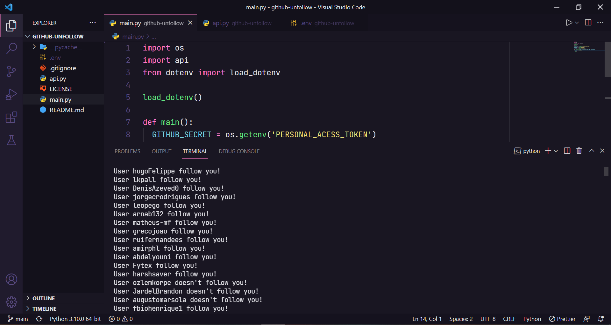

<h2 align="center"> 
   
</h1>

<p align="center">
  <a href="https://www.linkedin.com/in/frank-laercio/">
    
  </a>
  
  
  
  <a href="https://github.com/franklaercio/github-unfollow/commits/master">
    
  </a>
  
  

  
   <a href="https://github.com/franklaercio/github-unfollow/stargazers">
    
  </a>
</p>

## :bookmark_tabs: Resume of application

Code to unfollow all people don't follow you back. This app was created using [GitHub API](https://docs.github.com/en/rest) and you need to create a token for access GitHub API, check this content on [GitHub Documentation](https://docs.github.com/en/rest/guides/getting-started-with-the-rest-api).

<p align="center">
  
</p>

## 🎲 Running the project

```bash
# Clone this repository
$ git clone https://github.com/franklaercio/github-unfollow

# Access the project folder in the terminal/cmd
$ cd github-unfollow

# Create a new env local and adding your prismic url
$ cp .env.example .env.local

# Run the application
$ python main.py
```

## :books: GitHub Unfollow Configuration

1. Create a secret for access [GitHub API](https://docs.github.com/en/rest/guides/getting-started-with-the-rest-api)
2. Set your user em .env
3. Set time sleep, remember that you can only make 5000 requests.

## :man_technologist: Authors

* **Frank Laércio** - [franklaercio](https://github.com/franklaercio)

See also the list of [contributors](https://github.com/franklaercio/github-unfollow/contributors) who participated in this project.

## :clipboard: License

This project is licensed under the MIT License - see the [LICENSE.md](LICENSE.md) file for details

## :newspaper: Acknowledgments

- Python
- GitHub
- Rest
- API

Feito com :hearts: by Frank Laércio :wave:!
